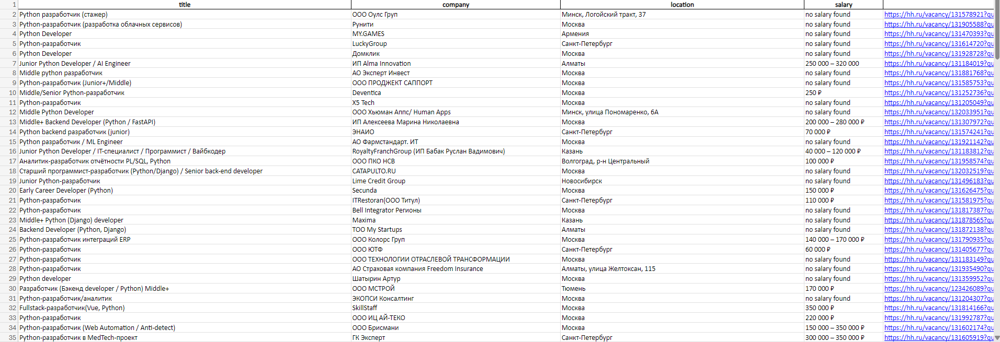

# hh.ru Python Vacancy Scraper

A Python web scraper that collects Python developer job listings from [hh.ru](https://hh.ru) and exports them to a formatted Excel file.

---

## Features

- Scrapes vacancy title, company, location, salary, and direct link
- Filters results by vacancy name (no irrelevant listings)
- Automatically skips duplicate vacancies
- Stops gracefully when no more pages are available
- Exports data to `.xlsx` with auto-fitted column widths and clickable links

---

## Requirements

- Python 3.8+
- See `requirements.txt` for dependencies

---

## Installation

```bash
git clone https://github.com/yourname/hh-scraper.git
cd hh-scraper
pip install -r requirements.txt
```

---

## Usage

```bash
python main.py
```

The script will scrape up to 20 pages and save results to `vacancies.xlsx` in the project directory.

---

## Output

An Excel file `vacancies.xlsx` with the following columns:

| Column | Description |
|--------|-------------|
| Title | Vacancy title |
| Company | Employer name |
| Location | City or address |
| Salary | Salary range (if provided) |
| Link | Clickable link to the vacancy page |

---

## Configuration

To change the search query or page limit, edit these lines in `main.py`:

```python
for page in range(1, 20):  # Change 20 to scrape more or fewer pages
    url = f'https://hh.ru/search/vacancy?text=python+developer&search_field=name&page={page}'
    #                                      ^^^^^^^^^^^^^^^^ Change search query here
```

---

## Notes

- A 1-second delay is added between requests to avoid getting blocked
- Salary is not always provided by employers — missing values are shown as `no salary found`
- The scraper searches by vacancy name only (`search_field=name`) to avoid unrelated results

---

Below is a preview of the generated Excel report:



## License

MIT
